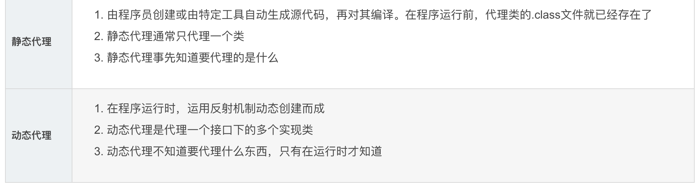
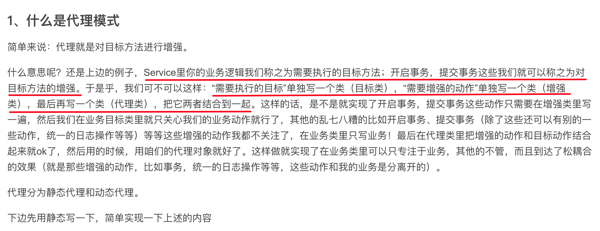
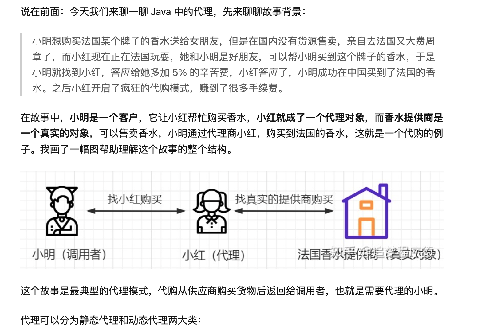
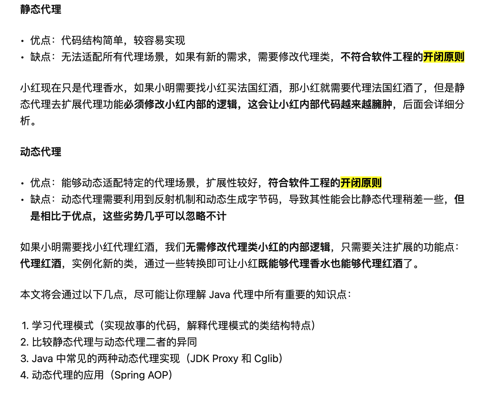
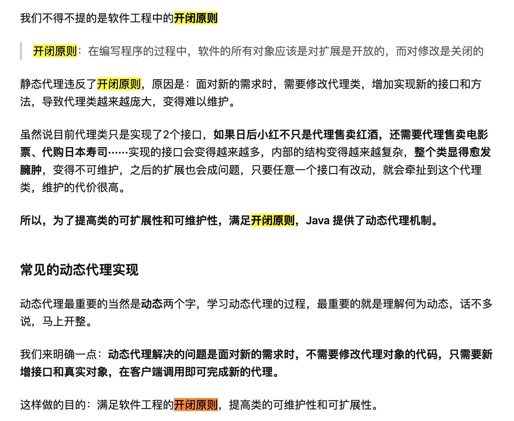

# Java静态代理和动态代理



# 静态代理

**SpringAOP系列，帮你了解SpringAOP的来龙去脉**

思考：以常见的增删改查为例，在执行增删改的时候我们需要开启事务，执行完成后需要提交事务

假如说你Service里有100个增删改的方法，那这100个方法里除了你自己真正需要处理的业务逻辑外，每个方法都还需要去关注开启事务，提交事务这些动作。

## 什么是代理模式



## 代码实现

业务接口

```java
package com.cj.study.proxy;
 
public interface PersonService {
  
  public void savePerson();
  
  public void updatePerson();
  
  public void deletePerson();
  
}
```

业务实现类

```java
package com.cj.study.proxy;
 
public class PersonServiceImpl implements PersonService{
 
  @Override
  public void savePerson() {
    System.out.println("添加");
  }
 
  @Override
  public void updatePerson() {
    System.out.println("修改");
  }
 
  @Override
  public void deletePerson() {
    System.out.println("删除");
  }
 
}
```

方法增强类（事物）

```java
package com.cj.study.proxy;
 
public class Transaction {
  public void beginTransaction(){
    System.out.println("开启事务 ");
  }
  public void commit(){
    System.out.println("提交事务");
  }
}
```

代理类

```java
package com.cj.study.proxy;
 
public class PersonServiceProxy implements PersonService{
  
  //目标类
  private PersonService personService;
  
  //增强类
  private Transaction transaction;
  
  //利用构造函数将目标类和增强类注入
  public PersonServiceProxy(PersonService personService,Transaction transaction){
    this.personService = personService;
    this.transaction = transaction;
  }
  
  @Override
  public void savePerson() {
    transaction.beginTransaction();
    personService.savePerson();
    transaction.commit();
  }
 
  @Override
  public void updatePerson() {
    transaction.beginTransaction();
    personService.updatePerson();
    transaction.commit();
  }
 
  @Override
  public void deletePerson() {
    transaction.beginTransaction();
    personService.deletePerson();
    transaction.commit();
  }
 
}
```

测试

```java
new PersonServiceProxy(new PersonServiceImpl(),new Transaction()).savePerson();
```

**静态代理是在程序运行前，代理类的.class文件就已经存在了**

## 应用

*   比如增删改查的前置任务和后置任务，有很多可以重用的，可以提取出来，使用代理模式

*   比如关闭连接数据库的连接

*   比如代理使客户端不需要知道实现类是什么，怎么做的，而客户端只需知道代理即可（解耦合）

*   跨网络调用对象：在程序设计当中，经常会出现客户端无法直接调用实际对象，因为可能客户端需要调用的对象在另外一台机器上，而我们则需要跨网络调用，如果直接调用的话，我们需要处理网络链接、打包和解包等非常复杂的步骤。所以为了简化客户端的处理，采用代理模式，在客户端创建一个代理对象，由代理对象去和实际对象联系。

*   使用代理对象还能很好的保护实际对象。

而代理模式又分为静态代理和动态代理，两种代理从虚拟机加载类的角度来讲，本质上都是一样的，都是在原有类的行为基础上，加入一些多出的行为，甚至完全替换原有的行为。

1.  代理类一般要持有一个被代理的对象的引用。

2.  对于我们不关心的方法，全部委托给被代理的对象处理。

3.  自己处理我们关心的方法。

**好处**：在不修改目标对象的前提下，可以通过代理对象对目标对象功能扩展

1.  通过代理对象的隔离，**可以在对目标对象访问前后增加额外的业务逻辑，实现功能增强。**

2.  通过代理对象访问目标对象，**可以防止系统大量地直接对目标对象进行不正确地访问，出现不可预测的后果**

**缺点**：代理类和委托类实现了相同的接口，代理类通过委托类实现了相同的方法。这样就出现了大量的代码重复。如果接口增加一个方法，除了所有实现类需要实现这个方法外，所有代理类也需要实现此方法。增加了代码维护的复杂度。

代理对象只服务于一种类型的对象，如果要服务多类型的对象。势必要为每一种对象都进行代理，静态代理在程序规模稍大时就无法胜任了。

静态代理违反了开闭原则，**面对新的需求时，需要修改代理类，增加实现新的接口和方法，导致代理类越来越庞大，变得难以维护。**

## 优缺点

*   优点

    1.  解耦

*   缺点

    1.  假设一个系统中有100个Service，则需要创建100个代理对象

    2.  如果一个Service中有很多方法需要事务（增强动作），发现代理对象的方法中还是有很多重复的代码

    3.  由第一点和第二点可以得出：静态代理的重用性不强

# 相关博客

😀[什么是代理模式？动态代理？静态代理？如何操作应用？ - 知乎](https://zhuanlan.zhihu.com/p/208221595 "什么是代理模式？动态代理？静态代理？如何操作应用？ - 知乎")

[Java中动态代理的两种方式JDK动态代理和cglib动态代理以及区别\_嗑嗑磕嗑瓜子的猫的博客-CSDN博客\_jdk动态代理和cglib代理区别](https://blog.csdn.net/ju_362204801/article/details/90714295 "Java中动态代理的两种方式JDK动态代理和cglib动态代理以及区别_嗑嗑磕嗑瓜子的猫的博客-CSDN博客_jdk动态代理和cglib代理区别")

[JDK动态代理与CGLIB动态代理\_weixin\_43529092的博客-CSDN博客\_jdk动态代理与cglib动态代理](https://blog.csdn.net/weixin_43529092/article/details/123902794 "JDK动态代理与CGLIB动态代理_weixin_43529092的博客-CSDN博客_jdk动态代理与cglib动态代理")

## 其他

**博客**[：什么是代理模式？动态代理？静态代理？如何操作应用？ - 知乎](https://zhuanlan.zhihu.com/p/208221595 "：什么是代理模式？动态代理？静态代理？如何操作应用？ - 知乎")







# 动态代理

*   静态代理是在程序运行之前，代理类的class文件就已经存在了

*   动态代理是在程序运行时利用反射机制动态创建而成的


### JDK动态代理

```java
package com.cj.study.proxyjdk;
 
import java.lang.reflect.InvocationHandler;
import java.lang.reflect.Method;
 
public class PersonServiceInterceptor implements InvocationHandler{
  //目标类
  private Object target;
  //增强类
  private MyTransaction myTransaction;
  //构造函数注入目标类和增强类
  public PersonServiceInterceptor(Object target,MyTransaction myTransaction){
    this.target = target;
    this.myTransaction = myTransaction;
  }
 
  //代理类的每一个方法被调用的时候都会调用下边的这个invoke方法
  @Override
  public Object invoke(Object proxy, Method method, Object[] args)
      throws Throwable {
    this.myTransaction.beginTransaction();
    Object returnValue = method.invoke(this.target, args);
    this.myTransaction.commit();
    return returnValue;
  }
  
}
```

测试

```java
package com.cj.study.proxyjdk;
 
import java.lang.reflect.Proxy;
import org.junit.Test;
 
public class ProxyTest {
  @Test
  public void test(){
    Object target = new PersonServiceImpl();
    MyTransaction myTransaction = new MyTransaction();
    PersonServiceInterceptor interceptor = new PersonServiceInterceptor(target, myTransaction);
    PersonService personService = (PersonService)Proxy.newProxyInstance(target.getClass().getClassLoader(), target.getClass().getInterfaces(),interceptor);
    String returnValue = (String)personService.savePerson();
    System.out.println(returnValue);
  }
}
```

注意：

1、当客户端执行代理对象.方法时，进入到了拦截器的invoke方法体

2、拦截器中invoke方法体的内容就是代理对象方法体的内容

3、拦截器中invoke方法的method参数是在调用的时候赋值的

invoke参数

*   proxy：代指反射创建的代理类 \$Proxy0

*   method

*   args

## cglib动态代理

首先需要导入cglib的jar包：cglib-nodep-2.1\_3.jar

```java
package com.cj.study.proxycglib;
 
import java.lang.reflect.Method;
import net.sf.cglib.proxy.Enhancer;
import net.sf.cglib.proxy.MethodInterceptor;
import net.sf.cglib.proxy.MethodProxy;
 
public class PersonServiceInterceptor implements MethodInterceptor{
  //目标类
  private Object target;
  //增强类
  private MyTransaction myTransaction;
  //构造函数注入目标类和增强类
  public PersonServiceInterceptor(Object target,MyTransaction myTransaction){
    this.target = target;
    this.myTransaction = myTransaction;
  }
  
  public Object createProxy(){
    Enhancer enhancer = new Enhancer();
    enhancer.setCallback(this);
    enhancer.setSuperclass(this.target.getClass());
    return enhancer.create();
  }
 
  @Override
  public Object intercept(Object arg0, Method arg1, Object[] arg2,
      MethodProxy arg3) throws Throwable {
    myTransaction.beginTransaction();
    Object returnValue = arg1.invoke(this.target, arg2);
    myTransaction.commit();
    return returnValue;
  }
  
}
```

最后需要知道的点：

1、JDK动态代理，要求目标类实现接口，但是有时候目标类直接一个单独的对象，并没有实现任何的接口，这时就得使用CGLib动态代理
2、JDK动态代理是JDK里自带的，CGLib动态代理需要引入第三方的jar包

3、CGLib动态代理，它是在内存中构建一个子类对象，从而实现对目标对象功能的扩展
4、CGLib动态代理，是基于继承来实现代理，所以无法对final类、private方法和static方法进行代理

以上就是动态代理的两种实现。

我们用上边的做法去实现目标方法的增强，实现代码的解耦，是没有问题的，但是还是需要自己去生成代理对象，自己手写拦截器，在拦截器里自己手动的去把要增强的内容和目标方法结合起来，这用起来还是有点繁琐，有更好的解决方案吗？

答案是：有的！那就是Spring的AOP，这才是咱们最终想引出来的重点！

有了Spring的AOP后，就不用自己去写了，只需要在配置文件里进行配置，配置好后Spring按照你的配置去帮你生成代理对象，按照你的配置把增强的内容和目标方法结合起来。就相当于自己写代码也能实现和aop类似的功能，但是有了Spring aop以后有些事情Spring帮你做了，而且人家Spring做成了可配置化，用起来非常简单而且很灵活

咱们上边用的JDK动态代理和cglib动态代理，这两种在Spring的AOP里都有用到，Spring是根据不同的情况去决定是使用JDK的动态代理生成代理对象，还是使用cglib去生成代理对象，具体的内容下一篇会讲到。
